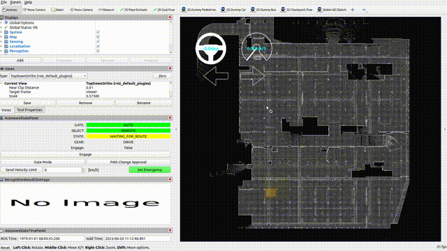
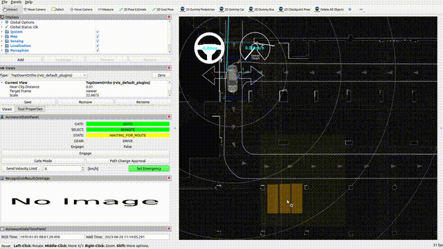
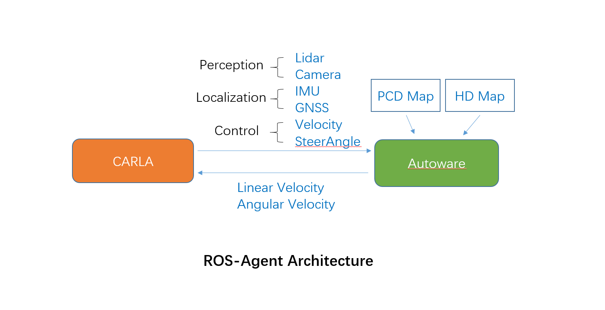

# ros-agent
This is a co-simulation project of AVP (Automated Valet Parking) based on CARLA and Autoware. Based on ROS2, the ros-agent retrieve sensor data from CARLA and transmit it to Autoware, then Autoware calculate the control command to pass it to CARLA to execute. 

 

---
## Requirements
- Ubuntu20.04
- CPU Intel i7 9th or higher
- RAM 32GB or more
- GPU 8GB or more
## Installation
The overall installation includes four parts:
- CARLA installation
- ROS2 installation
- Autoware installation
- ros-agent bridge installation
### CARLA
pass

### ROS2
This project is based on ROS2 galactic. In order to install galactic, please follow the official [tutorial](https://docs.ros.org/en/galactic/Installation/Ubuntu-Install-Debians.html).
### Autoware
Autoware is the world's leading open-source software project for AD(Autonomous Driving).Autoware includes the necessary functions to drive an autonomous vehicles from localization and object detection to route planning and control.This project use Autoware galactic as the AD stack. 
1. Clone Autoware repository
```shell
mkdir ~/ros-agent
cd ~/ros-agent
git clone https://github.com/ROS-Agent/autoware-modified.git -b galactic
```
2. Installing dependencies using Ansible. You can also install dependecies manually, following this [website](https://autowarefoundation.github.io/autoware-documentation/galactic/installation/autoware/source-installation/).
```shell
cd ~/ros-agent/autoware
./setup-dev-env.sh
```
3. Create the src directory and clone repositories into it.
```shell
mkdir src
vcs import src < autoware.repos
```
4. Install dependent ROS packages.
```shell
rosdep update --include-eol-distros
source /opt/ros/galactic/setup.bash
rosdep install -y --from-paths src --ignore-src --rosdistro $ROS_DISTRO
```
5. Build the workspace.
```shell
colcon build --symlink-install --cmake-args -DCMAKE_BUILD_TYPE=Release
```
### ROS-Agent bridge
The ROS-Agent brige is the data transmission bridge, which retrieves sensor data from CARLA to pass it to Autoware and receives Autoware control command to pass it CARLA.
1. Clone repositories and Maps.
```shell
mkdir -p ~/ros-agent/bridge
cd ~/ros-agent/bridge
git clone https://github.com/ROS-Agent/op_bridge.git -b AVP
git clone https://github.com/ROS-Agent/op_agent.git -b AVP
git clone https://github.com/ROS-Agent/scenario_runner.git
git clone https://github.com/ROS-Agent/Maps.git
```
2、Replace sensor config and launch files
```shell
cd ~/ros-agent/bridge/Maps
sudo mv autoware.launch.xml ~/ros-agent/autoware/src/launcher/autoware_launch/autoware_launch/launch/autoware.launch.xml
sudo mv gnss.launch.xml ~/ros-agent/autoware/src/sensor_kit/sample_sensor_kit_launch/sample_sensor_kit_launch/launch/gnss.launch.xml
sudo mv sensor_kit_calibration.yaml ~/ros-agent/autoware/src/sensor_kit/sample_sensor_kit_launch/sample_sensor_kit_description/config/sensor_kit_calibration.yaml
sudo mv sensors_calibration.yaml ~/ros-agent/autoware/src/sensor_kit/sample_sensor_kit_launch/sample_sensor_kit_description/config/sensors_calibration.yaml
```
3. Set environment variables
```shell
gedit ~/.bashrc
# Add the following line to the bottom of the file.
export CARLA_ROOT=~/carla
export PYTHONPATH=$PYTHONPATH:$CARLA_ROOT/PythonAPI/carla/dist/carla-0.9.13-py3.8-linux-x86_64.egg
export SCENARIO_RUNNER_ROOT=~/ros-agent/bridge/scenario_runner
export LEADERBOARD_ROOT=~/ros-agent/bridge/op_bridge
export TEAM_CODE_ROOT=~/ros-agent/bridge/op_agent
# Save the file and reset the terminal.
```

## Start the Simulation
1. Open one terminal
```sh
cd $CARLA_ROOT
./CarlaUE4.sh
```
2. Open another terminal
```sh
cd ~/ros-agent/autoware
source ./install/setup.bash
cd ~/ros-agent/bridge/op_bridge/op_scripts
./run_exploration_mode_ros2.sh
```
1. Set vehicle initial pose.
- (1) Click the `2D Pose estimate` button in the toolbar
- (2) In the 3D View pane, click and hold the left-mouse button, and then drag to set the direction for the initial pose, as the following gif image shows.


2. Set vehicle goal pose and `Engage` the vehicle, as the following gif image shows.
- (1) Click the `2D Goal Pose` button in the toolbar
- (2) In the 3D View pane, click and hold the left-mouse button, and then drag to set the direction for the goal pose. If done correctly, you will see a planned path from initial pose to goal pose
- (3) Click the `Engage` button in `AutowareStatePanel`

3. Enjoy!!


## ROS-Agent Architecture
this is a ROS-Agent Architecture which describes data flow of this project.

### How to create PCD Map
pass
### How to create HD Map
pass
## ROS-Agent Topic msg
pass


